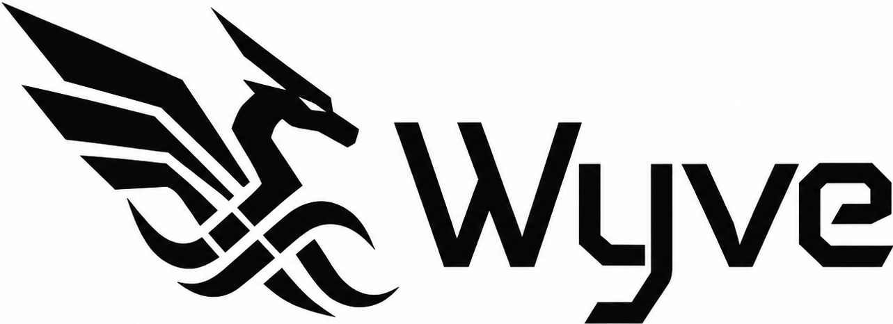

<p align="center">
  
</p>

<p align="center"><strong>Contracts for the optimizer.</strong></p>

Wyve is a static semantics language one layer above LLVM IR — low enough to
own the lowering, high enough that humans write contracts, not instructions.
You don't write programs in Wyve; you write kernels, and with them, the
contracts that make those kernels optimizable.

Not a safer C. Not a nicer LLVM IR. A contract language for code generation.

> **Wyve doesn't try to be the dragon. It rides it.**
>
> LLVM is the silver dragon — the fastest beast alive, but raw: ask it to
> vectorize and you can only pray it flies where you pointed. Wyve is the
> rider, the contract is the reins, and *proven, not promised* is the proof
> the dragon obeyed — every schedule transform verified to change the result
> by not one bit. The far side of *fastest* isn't more speed; it's speed
> whose flight path is confirmed, not hoped. — [the philosophy](docs/PHILOSOPHY.md)

## The idea

Optimizers are theorem provers starved of theorems. They spend most of their
time re-deriving facts the programmer knew all along: these pointers don't
alias, this function only writes there, this loop carries no dependence. And
when the proof fails, you get a scalar loop and no explanation.

Wyve inverts this. The facts *are* the source code:

```objc
@effect(reads(x, y), writes(y))
@vectorize(require, width: 8)
+ (void)saxpy:(float)a
            x:(@noalias const float *)x
            y:(@noalias float *)y
        count:(usize)n;
```

This is not a hint block. It is a permission slip with teeth:

- `@noalias` — proven against the language's ownership rules, not taken on faith
- `@effect` — the implementation is checked against it; writing anywhere else is a compile error
- `@vectorize(require)` — if the loop cannot vectorize, **compilation fails**, and the compiler tells you why

Same dragon, better reins: because every claim is proven, real Wyve code can
carry optimizer fuel that unchecked annotations never dare to. The aim is to
outrun general-purpose languages on LLVM's own back — the plan is in
[docs/DESIGN.md](docs/DESIGN.md#north-star), and the first measurements in
[bench/NOTES.md](bench/NOTES.md).

## The five contract classes

| Class        | Contracts                                                              |
| ------------ | ---------------------------------------------------------------------- |
| Alias        | `@noalias`, `@alias(scope)`, `@borrow`, `@owned`                       |
| Effect       | `@pure`, `@readonly`, `@effect(reads(…), writes(…))`, `@captures(none)` |
| Layout       | `@repr(c)`, `@align(n)`, `@soa`, `@packed`                             |
| Control flow | `@vectorize(require)`, `@unroll`, `@cold`, `@likely`, `@fp(reassoc)`   |
| Emission     | `@expect_ir`, `@target_feature`, `@intrinsic`, `@abi`                  |

Stage 0 implements the subset `@noalias`, `@effect(reads/writes)`,
`@vectorize(require, width, interleave, predicate, scalable, disable)`,
`@unroll(require, count)`, and `@fp(reassoc)`. Every numeric knob is
verified against LLVM's reply: demand `interleave: 4` and get 2, and the
build fails.

## Failure is a feature

In C, an optimization that doesn't happen is silent. In Wyve, a required
optimization that can't happen is an error with a reason:

```
error[WVN014]: vectorization required, but the loop carries a dependence:
               x[i] reads x[i - 1] written in the previous iteration
  --> examples/invalid/dependence.wyv:28
note: remove @vectorize(require) or restructure the recurrence
```

See [`examples/invalid/`](examples/invalid/) — files in this directory MUST
be rejected by the compiler. They are as much a part of the language as the
files that compile.

## Design principles

1. **Contracts are proven, not promised.** An unchecked `@noalias` is just
   undefined behavior with better ergonomics — worse than C, because the
   language would *encourage* you to write it. Every contract is verified
   against the implementation. `@noalias` is proven across call boundaries
   (stage 2): an argument bound to a `@noalias` parameter must itself be
   `@noalias`, and no pointer may reach two `@noalias` parameters — passing
   a buffer to a kernel in place is a compile error (WVN050), not silent UB.
   The outermost caller's `@noalias` is the calling language's obligation;
   from Rust, the borrow checker discharges it (`&mut`/`&` cannot alias),
   closing the loop end to end. The verifier itself is being verified:
   [`proofs/`](proofs/) holds Lean proofs of the analyses' soundness (the
   loop-carried dependence rule (WVN014), and that **all three schedule
   transforms are bitwise-exact** — they change the result by not one bit:
   `@parallel` (WVN025, independent writes commute, Lean core), `@interchange`
   (WVN024, loop interchange preserves the sum, Mathlib `Finset.sum_comm`), and
   `@tile` (WVN020–022, strip-mine reshapes the range, Mathlib
   `finProdFinEquiv`). `lake build` checks them. The bitwise-exact property the
   risk review *demonstrated* is now *proven*, all the way down — including
   that the 91.5-GFLOPS tiled matmul is exactly the naive one.
2. **Legality is decided by Wyve, not by LLVM's mood.** `@vectorize(require)`
   is checked by Wyve's own dependence analysis over a restricted loop form.
   LLVM's optimization remarks are a regression layer for catching toolchain
   bugs, not the definition of the language. Wyve's semantics must not change
   when LLVM's version does.
3. **Objective-C grammar, zero runtime.** Message syntax with labeled
   arguments makes effect contracts readable: `reads(x, y), writes(y)` names
   the same things the call site names. No `objc_msgSend`, no classes at
   runtime — every send is a static call.
4. **`@interface` is the contract surface.** What was once a compilation-model
   artifact becomes a semantic boundary: the `@implementation` must be proven
   to satisfy its `@interface`, or it does not compile.

## Anatomy

| Name       | Role                                                                  |
| ---------- | --------------------------------------------------------------------- |
| `Wyve`     | the language                                                          |
| `wyvec`    | the compiler                                                          |
| `.wyv`     | source files                                                          |
| `Wyveness` | the degree to which code exposes semantics the optimizer can trust    |

## Talking to LLVM

The primary implementation is in Racket, and it is conversational: a
`#lang wyve` file is a runnable Racket program whose surface syntax is
Objective-C. Running it verifies the contracts, converses with LLVM's
optimizer, then executes the kernels on LLVM:

```console
$ brew install minimal-racket
$ raco pkg install --link --auto -n wyve ./racket
$ racket examples/live.wyv
wyvec: 1 kernel, contracts verified
; talking to Apple clang version 14.0.3 (clang-1403.0.22.14.1)

Axpy [axpy:x:y:count:]
  you : @effect(reads(x, y), writes(y)) — verified against the body
  you : @noalias x, y — lowered to LLVM `noalias`
  you : @vectorize(require, width: 8) — proven legal by wyvec's dependence analysis
  llvm: vectorized loop (vectorization width: 8, interleaved count: 2)
  => contract honored: vectorized at the required width 8

; running on LLVM
Axpy_axpy: y[0..3] = 4 5.5 7 8.5  checksum = 789760
```

The conversation goes both ways — in the REPL you can retract a contract and
ask again:

```racket
(require wyve/repl)
(wyve-load "examples/saxpy.wyv")
(ask #:without-noalias '("x" "y"))
; wyvec: refused — it will not relay an unproven claim to LLVM  [WVN012]
(ask #:without-noalias '("x" "y") #:force #t)
; wyvec: objection noted — sending anyway. LLVM now decides alone:
; llvm: vectorized loop (vectorization width: 8, interleaved count: 2)
```

CLI without the REPL:

```console
$ racket -l wyve/cli -- check examples/saxpy.wyv   # verify contracts
$ racket -l wyve/cli -- build examples/saxpy.wyv   # emit LLVM IR
$ racket -l wyve/cli -- talk  examples/saxpy.wyv   # converse with the optimizer
$ racket -l wyve/cli -- run   examples/saxpy.wyv   # talk, then execute
$ racket -l wyve/cli -- tune  examples/reduce.wyv  # search schedules, measure, suggest
```

The implementation is pinned to [`examples/`](examples/): the kernels
vectorize at their contracted width, and both files in
[`examples/invalid/`](examples/invalid/) are rejected with the diagnostics
documented in their headers (`racket racket/tests.rkt`).

## Learn it

- [`docs/CHEATSHEET.md`](docs/CHEATSHEET.md) — the whole language on one page:
  types, expressions, statements, every contract, the CLI.
- [`docs/DIAGNOSTICS.md`](docs/DIAGNOSTICS.md) — what each `WVN…` rejection
  means and how to fix it.
- [`examples/`](examples/) — normative kernels (saxpy, matmul, FFT, …) and,
  in [`examples/invalid/`](examples/invalid/), the things that must *not*
  compile, each documenting its diagnostic.

## Status

The plan is managed in [`docs/roadmap/`](docs/roadmap/README.md) —
[`GRAND_PLAN.md`](docs/roadmap/GRAND_PLAN.md) states the aim: cover
LLVM's semantic surface as verified contracts, then accelerate. Open
design questions live in [`docs/DESIGN.md`](docs/DESIGN.md).

- [x] **Stage 0 — transcription**: parse `.wyv`, emit LLVM IR with the
  contracts translated to attributes and metadata. Done — plus more checking
  than stage 0 promised: `@effect` is verified against every access in the
  body (WVN003), and `@vectorize(require)` runs wyvec's own dependence
  analysis over the affine loop form (WVN010–WVN016).
- [ ] **Stage 1 — required optimization**: read LLVM's optimization remarks
  back as a regression layer, so a toolchain that fails to honor a legal
  contract is caught at build time.
- [ ] **Stage 2 — checked contracts**: `@noalias` is still trusted at call
  boundaries. Ownership analysis makes every contract a proof obligation.
  This is the language.
